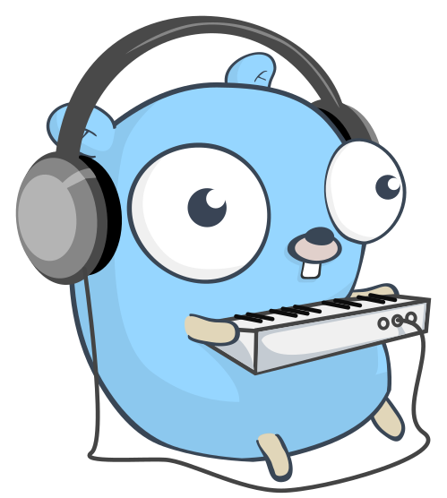

<p align="center">
  
</p>

<h1 align="center">
    GoTune
</h1>

Welcome to GoTune repository! This project aims to provide a backend system for a
music streaming application using the Go programming language. It allows you to
manage songs, albums, playlists, and more.

This is part of a project for my Programming Languages course at Costa Rica 
Institute of Technology.

## Features

- Create, retrieve, update, and delete songs, albums, and playlists.
- Stream audio files using Goroutines for efficient concurrent handling.
- SQLite database for data storage and retrieval.
- RESTful API for interacting with the backend.

## Setup

1. Clone this repository to your local machine:

```bash
git clone https://github.com/Johanx22x/GoTune.git
cd GoTune
```

2. Install the required Go packages:

```bash 
go mod download
```

3. Configure the backend settings by editing `config.go`.

4. Run the backend server:

```bash 
go run cmd/main/main.go
```

## API Endpoints

- `/songs`: Manage songs (GET, POST)
- `/songs/{id}`: Retrieve, update, or delete a song (GET, PUT, DELETE)
- `/albums`: Manage albums (GET, POST)
- `/albums/{id}`: Retrieve, update, or delete an album (GET, PUT, DELETE)
- `/playlists`: Manage playlists (GET, POST)
- `/playlists/{id}`: Retrieve, update, or delete a playlist (GET, PUT, DELETE)
- `/stream/{id}`: Stream audio for a song (GET)


## Contributing

Contributions are welcome! Feel free to open issues for bug reports, feature
requests, or any questions you might have. Pull requests are also accepted.

## License

This project is licensed under the MIT License. See the [LICENSE](LICENSE) file
for details.

